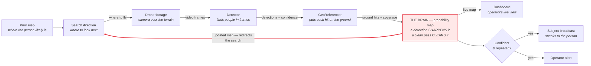

# The Core Loop — how the system works

This system is the decision **brain behind a search-and-rescue drone** — not the drone
itself. At its heart is a **probability map**: a live picture of where a missing person most
likely is. The map points the search where to look; the drone's camera feeds a detector;
what it finds — *and the empty ground it rules out* — flows back to update the map; and the
updated map redirects the next pass. When a detection is confident and repeats across
frames, the system speaks a calm message to the person and alerts the operator. The map is
the center of gravity — it's the part that visibly *reasons* about where to look.

---

## The loop at a glance



*The red arrow is the whole point: the map updates and **loops back** to redirect the next
search. That's what makes this a search system, not a one-shot detector.*

---

## Same loop, in text

```
  ┌─► Search direction ─► Drone footage ─► Detector ─► GeoReferencer ─┐
  │    (map picks where     (camera over     (finds       (places each  │
  │     to look next)        the terrain)     people in    hit on the    │
  │                                           frames)      ground)       │
  │                                                                      ▼
  │                                                            ┌──────────────────┐
  │   updated map redirects the next search                   │     THE BRAIN     │
  └────────────────────────────────────────────────────────────┤  probability map │
                                                              │                   │
              a detection SHARPENS the map  ───────────────►  │ (single source of │
              a clean, empty pass CLEARS it                   │  truth for "where │
                                                              │  is the person?") │
                                                              └────┬─────────┬────┘
                                                                   │         │
                                                        live map   │         │  confident
                                                          state    │         │  & repeated?
                                                                   ▼         ▼  (YES)
                                                            ┌──────────┐  ┌────────────────────┐
                                                            │ Dashboard│  │ Subject broadcast  │
                                                            │ live view│  │  + Operator alert  │
                                                            └──────────┘  └────────────────────┘
```

---

## What each part does

- **Prior map** — the starting belief of where the person is, built from the terrain
  (elevation, land cover, trails) before any flying.
- **Search direction** — the map picks the next place to look; this is what the drone is
  told to cover.
- **Drone footage** — the camera flies that path and records frames over the terrain.
- **Detector** — finds people in the frames and reports each hit with a confidence score.
  It works in pixels only — it doesn't know geography.
- **GeoReferencer** — turns each pixel hit into a real ground location, and records which
  ground was actually *seen* (the coverage).
- **The Brain (probability map)** — the single source of truth. It folds each observation
  into the map: a detection **sharpens** belief toward that spot; a clean pass over empty
  ground **clears** it. Then it picks where to look next — closing the loop.
- **Dashboard** — the operator's live view of the map: probability heat, where we've looked,
  detections, and the alert.
- **Located trigger** — fires only when a detection is both **confident** and **repeated**
  across frames, so a single false blip can't set it off.
- **Subject broadcast** — on a confident find, speaks a short, calm message to the person
  ("stay where you are, help is coming").
- **Operator alert** — flags the find to the search team.

---

## Why it's a loop, not a pipeline

Most detection demos are a straight line: footage in, boxes out. What makes this a *search*
system is the arrow that closes the circle — every detection, and every cleared patch of
empty ground, changes where we look next. A find isn't the end of a pipeline; it's new
evidence that reshapes the map. **Protect that closing arrow above everything else.**
